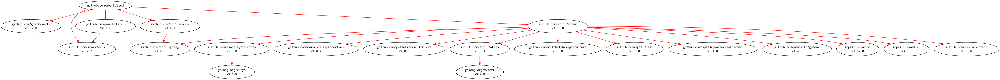

# [apod] - CLI Tool for Astronomy Picture of the Day with NASA API

[](https://github.com/goark/apod/actions)
[](https://github.com/goark/apod/actions)
[](https://raw.githubusercontent.com/goark/apod/master/LICENSE)
[](https://github.com/goark/apod/releases/latest)

This package is required Go 1.20 or later.

## Build and Install

```
$ go install github.com/goark/apod@latest
```

### Binaries

See [latest release](https://github.com/goark/apod/releases/latest).

## Usage

## Modules Requirement Graph

[](./dependency.png)

## Reference

- [NASA Open APIs](https://api.nasa.gov/)

[apod]: https://github.com/goark/apod "goark/apod: CLI Tool for Astronomy Picture of the Day with NASA API"
